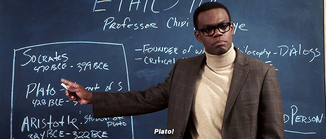
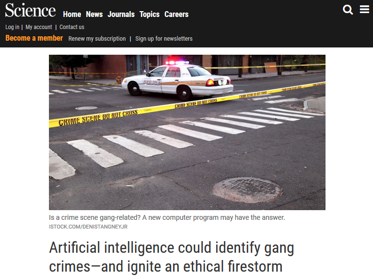
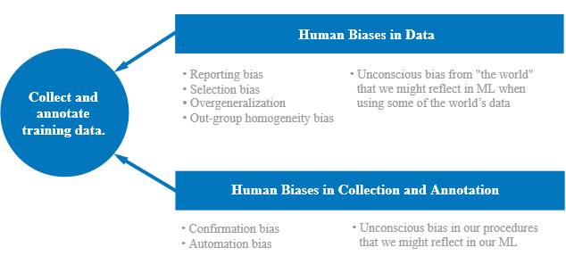
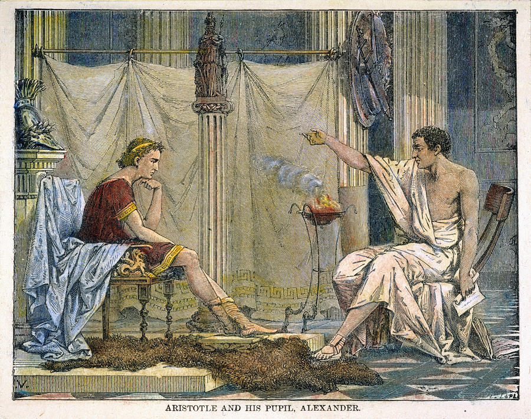
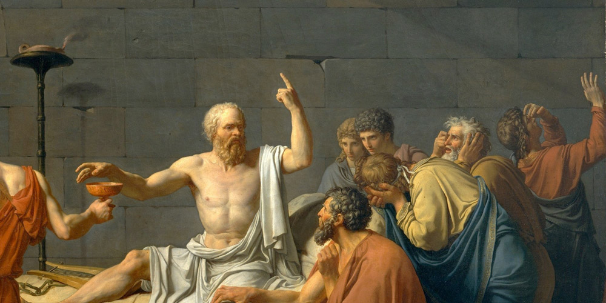
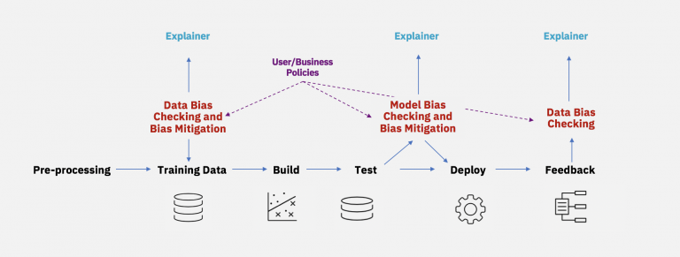
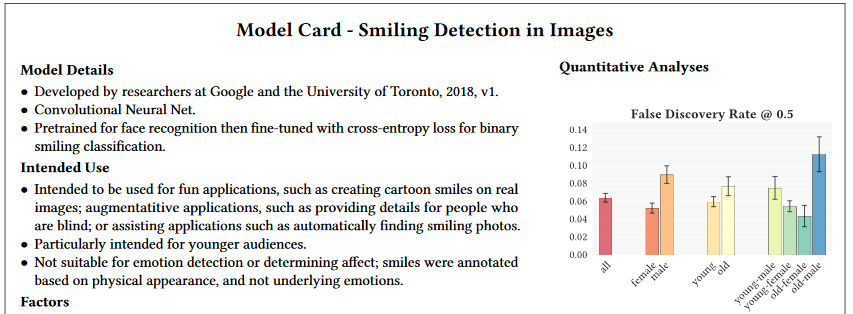
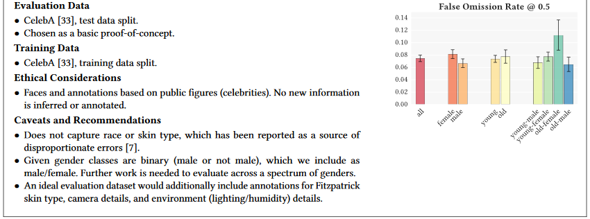
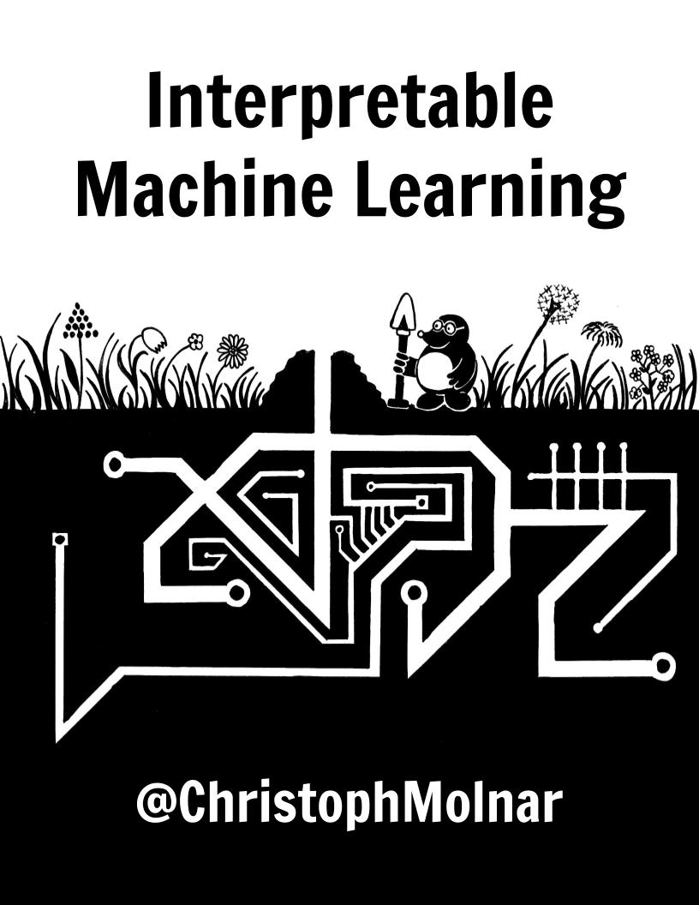
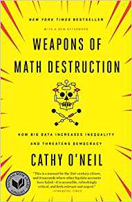

```{r setup, include=FALSE}
options(htmltools.dir.version = FALSE)
```

# What this talk *isn't* about

.center[]

---
# What this talk *is* about

1. Talk about common ethical issues you'll likely encounter in data science

--

2. Discuss my tips for handling them

--

3. Provide resources and libraries for tackling them

---
# Who am I?
* Worked at Booz Allen Hamilton for 5+ years working with various federal agencies on a variety of analytics problems

.center[]

* Currently leading Johnson & Johnson's data science team here in Rhode Island at the Providence Healthcare Technology Center

.center[]


---
class: inverse, center, middle

# Recognizing ethical issues

---
# An Illustrative Example



---
# An Illustrative Example
> ...researchers attending the...talk raised concerns during the Q&A afterward. How could the team be sure the training data were not biased to begin with? What happens when someone is mislabeled as a gang member? Lemoine asked rhetorically whether the researchers were also developing algorithms that would help heavily patrolled communities predict police raids.

--

> Hau Chan, a computer scientist now at Harvard University who was presenting the work, responded that he couldn’t be sure how the new tool would be used. “I’m just an engineer,” he said. Lemoine quoted a lyric from a song about the wartime rocket scientist Wernher von Braun, in a heavy German accent: “Once the rockets are up, who cares where they come down?” Then he angrily walked out.

--


---
# Common Ethical Issues

You don't fully understand **the context** for the problem you're solving.
--

- *Did these researchers look at the history of predictive policing?*

--

Your users don't **reasonably understand** the limitations of the solution you built.
--

- *Do these law enforcement officers understand what neural networks or black-box models can or can't do?*

--

You and/or your users **didn't think** about the potential ethical issues first.
--

- *Did these researchers and law enforcement officers discuss ethical issues in police work before development of this model?*

--

### This isn't limited to Machine Learning or AI! Any analysis or program can encounter these issues.

---
# Diving Deeper into Ethical Issues



Google [has a fantastic online course](https://developers.google.com/machine-learning/crash-course/fairness/video-lecture) that teaches you  about a wide variety of human biases and how to recognize them in a machine learning context.

---
class: inverse, center, middle

# Tips for handling ethical issues

---
# Don't work alone!

--
.pull-left[

]


.pull-right[
* Find someone else to talk through your problem with...
  - a friend
  - a colleague
  - a professor 

* Ethical issues are complicated and a different perspective often shines a light on something you may have missed.

* Make your approach as transparent as possible so others can collaborate or review your work.
]

---
# Learn about your problem's context!

--

.pull-left[
* The issues you'll be asked to tackle with data science aren't new ones. 

* Spend some time learning about the field you are jumping into and where people went wrong beforehand.

* A little research can go a long way to avoiding a serious issue later on.
]


.pull-right[

]


---
# Think about the ethics first! 

--
.pull-left[

]
.pull-right[
* Map out your problem and think about where things might go wrong or affect others.

* Pick metrics that will help you track/measure these potential issues. _Hint: Default metrics often are **not** the best ones to track these._

* You can't expect to avoid ethical issues after you've already developed a solution.
]

---
# Be clear with your users!

--

* Not every user has a PhD in Computer Science!

* Make it easy for them to understand when and how to apply your solution.

* Unintended ethical issues can be more prevalent than intended ones.


.center[]


---
class: inverse, center, middle

# Some helpful resources

---
# IBM AI Fairness 360

.center[]

An [open-source Python toolkit](http://aif360.mybluemix.net/) that contains about a dozen different metrics/algorithms to aid in bias detection and avoidance for machine learning projects.


---
# Model Cards

.center[]

An [extensible, proven format](https://arxiv.org/abs/1810.03993) for sharing model information with your users.


.center[]

It even has an ethical considerations section!


---
# Interpretable Machine Learning
.pull-left[

]

.pull-right[
A [free textbook](https://christophm.github.io/interpretable-ml-book/) which provides step-by-step instructions on how to inspect and interpret all types of machine learning models.

* Partial Dependence Plots
* LIME (Locally Interpretable Model-Agnostic Explanations)
* Shapley Values
* ...and more!
]

---
# More Resources
- [Analyzing & Preventing Unconscious Bias in Machine Learning](https://www.infoq.com/presentations/unconscious-bias-machine-learning) by Rachel Thomas
- [Machinebias.org](http://machinebias.org/)
- [How To Stop Artificial Intelligence From Marginalizing Communities?](https://www.youtube.com/watch?v=PWCtoVt1CJM) by Timnit Gebru
- [Awesome Machine Learning Interpretability](https://github.com/jphall663/awesome-machine-learning-interpretability)
- [Weapons of Math Destruction](https://www.amazon.com/Weapons-Math-Destruction-Increases-Inequality/dp/0553418831/ref=as_li_ss_tl?ie=UTF8&qid=1532024714&sr=8-1&keywords=weapons+of+math+destruction&linkCode=sl1&tag=theopesoudats-20&linkId=6d7cfcea0ff64900854da08d3512a94e) by Cathy O'Neil

.center[]


---
class: inverse, center, middle

# Thanks!